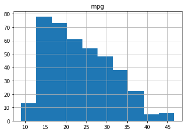
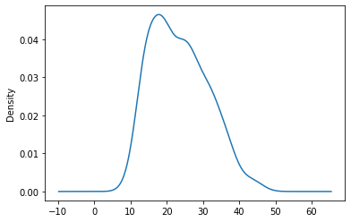
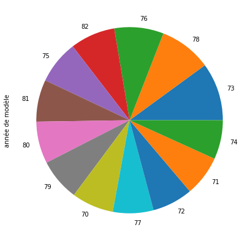

```python
import math # import math pour importé une biblioteque
```


```python
# trouvé la solution de 3x**2-7x=23

a=3
b=-7
c=-23
delta=b**2 -4*a*c
print(delta)
```

    325


```python
racinededalta=math.sqrt(325)
```


```python
x1=(7-racinededalta)/2*a
print(x1)
```

    -16.54163456597992


```python
x2=(7+racinededalta)/2*a
print(x2)
```

    37.54163456597992


```python
"""il y a une fonction qui renvoie le plus grand diviseur commun à a et b trouver la forme irréductible de la
somme:217/440 + 101/256 + 86/71"""

d=440*256*71
print(d)
```

    7997440


```python
n=(217*256*71)+(101*440*71)+(86*440*256)
print(n) 
```

    16786472


```python
a=7997440
b=16786472
print (math.gcd(a,b))
```

    8


```python
"""Ecrire un programme qui, à partir de la saisie d/un rayon et d/une hauteur, calclue le volume d/un cône 
droit(utulisé l/instruction input pour saisir les valeurs et print pour afficher le resultat)"""

R = float(input('quelle est le rayon'))
h = float(input('quelle est la hauteur'))
v=((math.pi)*(R**2)*h)/3
print(v)
```

    quelle est le rayon5
    quelle est la hauteur6
    157.07963267948966


```python
"""Etant donné les longueurs des coté d'un triangle(hypoténuse, coté adjacent ) écrire un programme qui vérifie
si un triangle est réctangle"""

import math
a = int(input( " entrez un nombre : "))
if a%2 == 0:
    print("paire")
else:
    print("impaire") 
```

     entrez un nombre : 3
    impaire


```python
a = float(input("entrez longueur de a"))
b = float(input("entrez longueur de b"))
c = float(input("entrez longueur de c"))
if (b**2 == c**2 + a**2) or (a**2 == b**2 + c**2) or (c**2 == a**2 + b**2):
    print ("le triangle est réctangle")
    if (a**2 == b**2 + c**2):
        print ("a est l'hypoténuse")
    elif (b**2 == a**2 + c**2):
        print ("b est l'hypoténuse")
    else :
        print ("c est l'hypoténuse")
else:
    print ("le triangle n'est pas réctangle")
```

    entrez longueur de a3
    entrez longueur de b4
    entrez longueur de c5
    le triangle est réctangle
    c est l'hypoténuse


```python
"""Créer un programme qui donne le prix TTC  aprés avoir saisie le prix HT. Ce programme doit se répéter entrer
plusieur prix à la suite et ne s'arrêtter que si l'utulisateur rentre 0"""

x = 0
a = x*1.2
x = float(input("entrez la valeur HT"))
while x != 0:
    x = float(input("entrez la valeur HT"))
    a = x*1.2
    print("prix TTC est:",a)
    
print("fin")
    

```

    entrez la valeur HT1
    entrez la valeur HT2
    prix TTC est: 2.4
    entrez la valeur HT3
    prix TTC est: 3.5999999999999996
    entrez la valeur HT4
    prix TTC est: 4.8
    entrez la valeur HT0
    prix TTC est: 0.0
    fin


```python
"""Ecrire un programme qui vérifie si la liste[1,2,3,4,3,2,1] est palaindrome"""

c = [1,2,3,4,3,2,1]
a = c.copy()
a.reverse()
x=0
for i in c:
    if c[i] == a[i]:
        x=x
    else:
        x=x+1
        
if x == 0:
    print("liste palindrome")
else:
    print("ce n'est pas une liste palindrome")
```

    liste palindrome


```python
list = [1, 2, 3 , 4 , 3, 2, 1]
listReverse = []

for i in list:
    listReverse.insert(0, i)
    print(listReverse)
if list == listReverse:
    print("C'est un palindrome(for)")
else: 
    print("ce n'est pas un palindrome(for)\n\n")
```

    [1]
    [2, 1]
    [3, 2, 1]
    [4, 3, 2, 1]
    [3, 4, 3, 2, 1]
    [2, 3, 4, 3, 2, 1]
    [1, 2, 3, 4, 3, 2, 1]
    C'est un palindrome(for)


```python
"""Proposer un petit programme en Python qui à partir de la liste des personnes de Simplon (aprenant et équipe
pédagogique incluse) tire au hasard (on sait que les machines propose du pseudo aléatoire, mais faisons com si)
deu nom pour proposer l'échange de cadeaux"""

import random
list =["Samba Cisse", "Rafik Lachaal", "Jonathan Michel", "Hachem Mosbah", "Ines Dridi", "Ludovic Randon", "Yoann Lucido", "Noemie Sauer", "Sabine Nasr", "Romain Grimaldi", "Sacha Kojic", "Joshua Harris", "Dylan Poinsu", "Daniel Kaddous", "Yacine Bourezak", "Denys Pes", "Jonathan Belletrud", "lotfi Baya"]
random.shuffle(list)
       
for i in range(len(list)-1):
    print(list[i], "donne son cadeau à", list[i+1])
       
print(list[-1], "donne son cadeau à", list[0])
```

    Hachem Mosbah donne son cadeau à lotfi Baya
    lotfi Baya donne son cadeau à Joshua Harris
    Joshua Harris donne son cadeau à Noemie Sauer
    Noemie Sauer donne son cadeau à Romain Grimaldi
    Romain Grimaldi donne son cadeau à Sabine Nasr
    Sabine Nasr donne son cadeau à Daniel Kaddous
    Daniel Kaddous donne son cadeau à Sacha Kojic
    Sacha Kojic donne son cadeau à Jonathan Belletrud
    Jonathan Belletrud donne son cadeau à Samba Cisse
    Samba Cisse donne son cadeau à Ludovic Randon
    Ludovic Randon donne son cadeau à Yacine Bourezak
    Yacine Bourezak donne son cadeau à Rafik Lachaal
    Rafik Lachaal donne son cadeau à Ines Dridi
    Ines Dridi donne son cadeau à Dylan Poinsu
    Dylan Poinsu donne son cadeau à Denys Pes
    Denys Pes donne son cadeau à Jonathan Michel
    Jonathan Michel donne son cadeau à Yoann Lucido
    Yoann Lucido donne son cadeau à Hachem Mosbah


```python
#importer les donées avec pandas

import pandas as pd #importer pandas

liste=["mpg","cylindres","déplacement","puissance","poids","accélération","année de modèle","origine",
"nom de la voiture)"] #crée une liste

auto=pd.read_excel('/Users/mosbahhachem/Documents/git/environnement_dev_data/exercice_python/exercice_python/autompg.xlsx', sep= '\t', names =liste)


print(auto)
```

          mpg  cylindres  déplacement  puissance  poids  accélération  \
    0    18.0          8        307.0      130.0   3504          12.0   
    1    15.0          8        350.0      165.0   3693          11.5   
    2    18.0          8        318.0      150.0   3436          11.0   
    3    16.0          8        304.0      150.0   3433          12.0   
    4    17.0          8        302.0      140.0   3449          10.5   
    ..    ...        ...          ...        ...    ...           ...   
    393  27.0          4        140.0       86.0   2790          15.6   
    394  44.0          4         97.0       52.0   2130          24.6   
    395  32.0          4        135.0       84.0   2295          11.6   
    396  28.0          4        120.0       79.0   2625          18.6   
    397  31.0          4        119.0       82.0   2720          19.4   
    
         année de modèle  origine         nom de la voiture)  
    0                 70        1  chevrolet chevelle malibu  
    1                 70        1          buick skylark 320  
    2                 70        1         plymouth satellite  
    3                 70        1              amc rebel sst  
    4                 70        1                ford torino  
    ..               ...      ...                        ...  
    393               82        1            ford mustang gl  
    394               82        2                  vw pickup  
    395               82        1              dodge rampage  
    396               82        1                ford ranger  
    397               82        1                 chevy s-10  
    
    [398 rows x 9 columns]


```python
#produire les statistiques decrivant les données:

import pandas as pd #importer pandas
import matplotlib as plt #importer mathplotlib


liste=["mpg","cylindres","déplacement","puissance","poids","accélération","année de modèle","origine",
"nom de la voiture)"] #crée une liste
import pandas as pd #importer pandas
import matplotlib as plt #importer mathplitlib

liste=["mpg","cylindres","déplacement","puissance","poids","accélération","année de modèle","origine",
"nom de la voiture)"] #crée une liste                 
auto=pd.read_excel('/Users/mosbahhachem/Documents/git/environnement_dev_data/exercice_python/exercice_python/autompg.xlsx', sep= '\t', names =liste)


print(auto.shape) #nombre de ligne et nombre de colonne
print("moyenne.mpg",auto['mpg'].mean()) #la moyenne
print(auto.describe(include='all'))
```

    (398, 9)
    moyenne.mpg 23.514572864321615
                   mpg   cylindres  déplacement   puissance        poids  \
    count   398.000000  398.000000   398.000000  392.000000   398.000000   
    unique         NaN         NaN          NaN         NaN          NaN   
    top            NaN         NaN          NaN         NaN          NaN   
    freq           NaN         NaN          NaN         NaN          NaN   
    mean     23.514573    5.454774   193.425879  104.469388  2970.424623   
    std       7.815984    1.701004   104.269838   38.491160   846.841774   
    min       9.000000    3.000000    68.000000   46.000000  1613.000000   
    25%      17.500000    4.000000   104.250000   75.000000  2223.750000   
    50%      23.000000    4.000000   148.500000   93.500000  2803.500000   
    75%      29.000000    8.000000   262.000000  126.000000  3608.000000   
    max      46.600000    8.000000   455.000000  230.000000  5140.000000   
    
            accélération  année de modèle     origine nom de la voiture)  
    count     398.000000       398.000000  398.000000                398  
    unique           NaN              NaN         NaN                305  
    top              NaN              NaN         NaN         ford pinto  
    freq             NaN              NaN         NaN                  6  
    mean       15.568090        76.010050    1.572864                NaN  
    std         2.757689         3.697627    0.802055                NaN  
    min         8.000000        70.000000    1.000000                NaN  
    25%        13.825000        73.000000    1.000000                NaN  
    50%        15.500000        76.000000    1.000000                NaN  
    75%        17.175000        79.000000    2.000000                NaN  
    max        24.800000        82.000000    3.000000                NaN  


```python
#produire les graphiques adapter au données:

import pandas as pd #importer pandas
import matplotlib as plt #importer mathplitlib


liste=["mpg","cylindres","déplacement","puissance","poids","accélération","année de modèle","origine",
"nom de la voiture)"] #crée une liste

auto=pd.read_excel('/Users/mosbahhachem/Documents/git/environnement_dev_data/exercice_python/exercice_python/autompg.xlsx', sep= '\t', names =liste)
auto.hist(column='mpg')#histograme
```


    array([[<matplotlib.axes._subplots.AxesSubplot object at 0x1182a3b10>]],
          dtype=object)





```python
import pandas as pd #importer pandas
import matplotlib as plt #importer mathplitlib


liste=["mpg","cylindres","déplacement","puissance","poids","accélération","année de modèle","origine",
"nom de la voiture)"] #crée une liste

auto=pd.read_excel('/Users/mosbahhachem/Documents/git/environnement_dev_data/exercice_python/exercice_python/autompg.xlsx', sep= '\t', names =liste)
auto['mpg'].plot.kde()#density plot
```


    <matplotlib.axes._subplots.AxesSubplot at 0x1a1c3bdb90>





```python
import pandas as pd #importer pandas
import matplotlib.pyplot as plt #importer mathplitlib

liste=["mpg","cylindres","déplacement","puissance","poids","accélération","année de modèle","origine",
"nom de la voiture)"] #crée une liste

plt.figure(figsize=(7,7))#pour gérer la taille du graphique 
auto=pd.read_excel('/Users/mosbahhachem/Documents/git/environnement_dev_data/exercice_python/exercice_python/autompg.xlsx', sep= '\t', names =liste)
auto['année de modèle'].value_counts().plot.pie()#diagramme à secteur 
```


    <matplotlib.axes._subplots.AxesSubplot at 0x1a1c455f90>





```python

```
